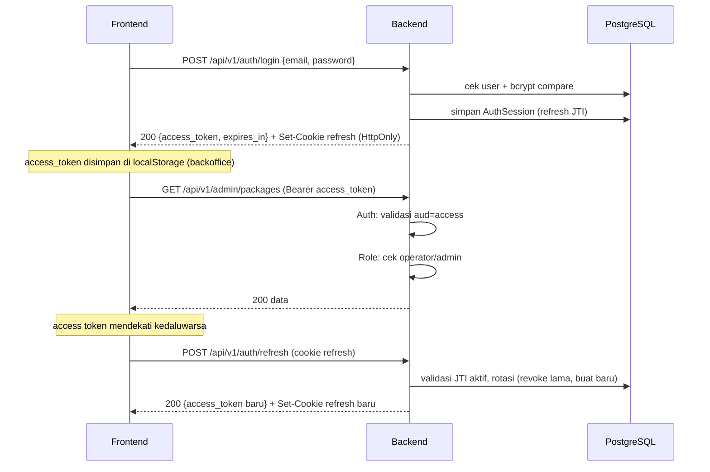

# API Reference

Dokumentasi seluruh endpoint HTTP backend Vero Travel Agents. Backend memakai Gin dan mengembalikan envelope respons seragam untuk semua endpoint.

- Base URL (dev): `http://localhost:8080`
- Definisi rute: [backend/internal/routes/routes.go](../../backend/internal/routes/routes.go)
- Handler: [backend/internal/handlers/handlers.go](../../backend/internal/handlers/handlers.go)
- OpenAPI 3.1: [backend/internal/handlers/docs.go](../../backend/internal/handlers/docs.go) (live di `/openapi.json`, UI di `/docs`)

## Envelope Respons

Semua endpoint mengembalikan struktur yang sama (lihat [backend/internal/utils/response.go](../../backend/internal/utils/response.go)):

```json
{
  "success": true,
  "message": "Human readable message",
  "data": {},
  "error": {}
}
```

- `success`: boolean status.
- `message`: pesan singkat untuk UI/log.
- `data`: payload sukses (omit saat error).
- `error`: detail error (omit saat sukses).

Frontend mem-parse envelope ini dan melempar `Error(message)` bila `success=false` atau status non-2xx (lihat `apiFetch` di kedua frontend).

## Middleware Global

Diterapkan ke semua request via `router.Use(...)` di [backend/cmd/server/main.go](../../backend/cmd/server/main.go):

| Middleware | Fungsi | Sumber |
|---|---|---|
| `RequestID` | Set/teruskan `X-Request-ID` per request | [middlewares.go](../../backend/internal/middlewares/middlewares.go) |
| `SecureHeaders` | `X-Content-Type-Options`, `X-Frame-Options`, dll | sda |
| `CORS` | Izinkan origin `localhost:3000/3001/5173`, `AllowCredentials=true` | sda |
| `RateLimit` | 20 req/detik global per-IP (token bucket) | sda |
| `gin.Logger` | Log akses | gin |
| `Recovery` | Tangani panic -> 500 envelope | sda |

## Middleware Per-Rute

- `AuthRateLimit` — grup `/auth`: 5 req/detik per-IP (anti brute force).
- `PublicWriteRateLimit` — `POST /chat` & `POST /orders`: 5 req/**menit** per-IP, bucket terpisah per route (SEC-13, anti spam order & abuse biaya LLM).
- `RequestBodyLimit` — `POST /chat` & `POST /orders`: body JSON maksimum 64 KiB (SEC-16).
- `Auth(jwt)` — wajib `Authorization: Bearer <access_token>`. Memvalidasi audience `access`. Jika refresh token dipakai sebagai access, dicatat sebagai event audit `refresh_token_used_as_access`. Set `user_id`, `role`, `email` ke context.
- `Role(roles...)` — RBAC; harus dijalankan SETELAH `Auth`. Membandingkan `role` di context dengan daftar role yang diizinkan.

## Authentication & Authorization Flow



Poin penting:
- Dua token dipisah by **audience claim**: `access` (TTL default 15 menit) dan `refresh` (TTL default 720 jam).
- Refresh token disimpan sebagai `AuthSession` di DB (punya `TokenJTI`), dikirim sebagai **cookie HttpOnly** di path `/api/v1/auth`. Tidak pernah masuk ke JS.
- Setiap refresh **merotasi** session (revoke lama, terbitkan baru).
- **Reuse detection**: jika refresh token yang sudah dirotasi dipakai lagi LEBIH DARI 1 menit setelah rotasi (`refreshRotationConcurrentWindow`) — indikasi pencurian — SEMUA sesi user dicabut + log `refresh_token_reuse_detected`. Rotasi di bawah window (concurrent refresh dua tab) hanya ditolak tanpa revoke-all (fix BUG-1; rotasi atomik via `RotateSession`). Lihat `AuthService.Refresh()` di [auth_service.go](../../backend/internal/services/auth_service.go).
- Guest chat membuat user "Guest Traveler" otomatis tanpa login.
- Implementasi JWT: [backend/internal/auth/jwt.go](../../backend/internal/auth/jwt.go); cookie: [backend/internal/auth/cookie.go](../../backend/internal/auth/cookie.go); audit: [backend/internal/auth/audit.go](../../backend/internal/auth/audit.go).

## Daftar Endpoint

Legenda: 🔓 publik · 🔒 butuh access token · 👮 butuh role operator/admin.

### Health & Docs

| Method | Path | Akses | Fungsi |
|---|---|---|---|
| GET | `/health` | 🔓 | Status service + uptime |
| GET | `/health/database` | 🔓 | Cek koneksi DB (timeout 3s) |
| GET | `/openapi.json` | 🔓 | Spec OpenAPI 3.1 |
| GET | `/docs` | 🔓 | Scalar API reference UI |

### Auth (`/api/v1/auth`)

| Method | Path | Akses | Fungsi |
|---|---|---|---|
| POST | `/register` | 🔓 | Daftar user; set cookie refresh; balas access token |
| POST | `/login` | 🔓 | Login email/username + password |
| POST | `/refresh` | 🔓 (cookie) | Rotasi refresh -> access token baru |
| POST | `/logout` | 🔓 (cookie) | Revoke session + hapus cookie |
| GET | `/me` | 🔒 | Profil user saat ini |

> Grup `/auth` memakai rate limit per-IP lebih ketat (`AuthRateLimit`, ~5 req/detik) untuk meredam brute force (SEC-7).

Request penting:
- `register`: `{name, email, password(min 8)}` (DTO `RegisterRequest`).
  - ✅ **SEC-1 sudah diperbaiki:** register publik **selalu** membuat user biasa (`RoleUser`). Field `role` dihapus dari DTO dan diabaikan total. Pembuatan operator/admin lewat endpoint admin terproteksi (lihat tabel Admin: `POST /admin/users`).
- `login`: `{email|username, password}` (DTO `LoginRequest`).
- `refresh`/`logout`: tanpa body; refresh token dibaca dari cookie HttpOnly.
- Response auth: `{access_token, token_type:"Bearer", expires_in, user}` (user di-omit pada refresh).

### Chat & AI

| Method | Path | Akses | Fungsi |
|---|---|---|---|
| POST | `/api/v1/chat` | 🔓 guest (rate limit 5/menit per-IP, SEC-13) | Jalankan workflow AI; balas message + recommended_packages |
| GET | `/api/v1/chat/sessions` | 🔒 | Daftar sesi chat milik user |
| GET | `/api/v1/chat/:id/messages` | 🔒 | Pesan dalam satu sesi |
| GET | `/api/v1/chat/history` | 🔓 guest cookie | Pulihkan history guest aktif; session identifier tidak diterima dari request dan tidak dikembalikan |
| GET | `/api/v1/events/stream` | 👮 | SSE stream event workflow/payment/log (khusus operator/admin — SEC-18) |

### Temporary Manual Order Flow

| Method | Path | Auth | Description |
|---|---|---|---|
| POST | `/api/v1/orders` | 🔓 guest cookie (rate limit 5/menit per-IP, SEC-13) | Buat order guest; tersimpan sebagai `booking_status=pending`, `payment_status=pending_admin_processing`; tidak membuat DOKU payment/session. **Satu order per GuestSession** (lihat di bawah); wajib header `Idempotency-Key` |
| GET | `/api/v1/orders/:id` | 🔓 guest cookie | Detail order MILIK guest session saat ini (anti-IDOR: cookie token + `bookings.guest_session_id` harus cocok; UUID saja tidak cukup) |

**Guest Order Limit (18 Agu 2026).** Identitas guest adalah `GuestSession` server-side; browser membawa token opaque random 256-bit via cookie HttpOnly `vero_guest_session` (path `/api/v1`, TTL `GUEST_IDENTITY_TTL_HOURS`, default 720 jam; hanya SHA-256 hash disimpan di DB). Kebijakan ditegakkan di `BookingService` dalam SATU transaction: lock row guest `FOR UPDATE`, validasi trip/pax/tanggal/kontak, insert booking, konsumsi entitlement (`order_count=1`). Chat baru/refresh/hapus localStorage TIDAK mereset allowance. Percobaan order kedua dibalas HTTP 403:

```json
{ "success": false, "message": "Please sign in to create another order.", "error": { "status": "authentication_required", "code": "GUEST_ORDER_LIMIT_REACHED" } }
```

`Idempotency-Key` (16-200 char) wajib di `POST /orders` dan `POST /bookings`; retry dengan key sama mengembalikan booking yang sama (hash di `bookings.idempotency_key_hash`, unique). Error validasi dibalas `400` dengan `error.code` = `BOOKING_VALIDATION_FAILED` atau `IDEMPOTENCY_KEY_REQUIRED` - keduanya TIDAK mengonsumsi allowance. Setelah login/register sukses, backend meng-claim order guest ke akun (cookie-diverifikasi, single-use, atomic) dan user bisa membuat order tambahan via `POST /bookings`. Detail lengkap: [GUEST_ORDER_LIMIT.md](../GUEST_ORDER_LIMIT.md).

- `chat` request: `{prompt(min 2, max 4000), session_id?, stream?}` (DTO `ChatRequest`). Body maksimum 64 KiB. `session_id` hanya dipakai bila milik caller; ID sesi asing/tidak ditemukan diabaikan dan request dibuat pada sesi baru milik caller (SEC-17). `stream` (bool, default `false`) mengaktifkan mode streaming SSE (PERF-1).
- `chat` response data: `{message, workflow[], show_recommendations, recommendation_reason, recommended_packages[]}` (lihat `ChatResult`). Session identifier tidak dikembalikan di JSON; browser memakai HttpOnly cookie `vero_chat_session`.
  - `show_recommendations` boolean: apakah frontend harus menampilkan daftar rekomendasi.
  - `recommendation_reason`: `"initial"` (rekomendasi pertama), `"alternative"` (user meminta alternatif), atau `""` (tidak ada rekomendasi).
  - `recommended_packages` hanya berisi hasil tool `search_trips`; backend tidak lagi melakukan scoring otomatis setelah LLM selesai menjawab.

#### Streaming mode (`stream: true`, PERF-1 — 3 Agu 2026)

Saat `stream:true`, response berubah dari envelope JSON menjadi **Server-Sent Events** (`Content-Type: text/event-stream`). Tool-selection rounds tetap non-streaming; hanya final text round LLM yang di-stream token-by-token. Rate limit + body limit 64 KiB tetap berlaku (route sama). Klien memakai `fetch` + `ReadableStream` reader (lihat `streamChat` di `frontend/src/lib/api.ts`), bukan `EventSource`, karena `POST` tidak didukung `EventSource` native.

Event SSE yang dipancarkan:
- `delta` — `{content}`: fragmen teks asisten (append ke pesan in-flight).
- `done` — `ChatResult` utuh (`{message, workflow, show_recommendations, recommendation_reason, recommended_packages}`): terminal, klien finalisasi state (packages, flags).
- `error` — `{message}`: bila tool loop/stream gagal mid-flight; koneksi ditutup setelahnya.

Cookie guest `vero_chat_session` di-set SEBELUM body SSE mulai (header tak bisa berubah setelah body). Non-stream path (`stream:false`/default) tetap memakai envelope JSON via `utils.Success`. Catatan: SSE streaming chat berbeda dari endpoint staff `/events/stream` (event bus broadcast) — keduanya terpisah; streaming chat adalah direct response per-request, bukan subscriber event bus.
- Guest chat memakai cookie `vero_chat_session` dengan `HttpOnly`, `Secure` mengikuti `GUEST_COOKIE_SECURE`, `SameSite` dari `GUEST_COOKIE_SAME_SITE` (default `Lax`), path `/api/v1/chat`, dan sliding TTL default 7 hari (`GUEST_SESSION_TTL_HOURS`).
- Guest `ChatSession.UserID` bernilai `NULL`. Session expired ditolak dan dibersihkan bersama message/tool-call/AI-log terkait.

### Packages (publik) & Trips (terproteksi)

| Method | Path | Akses | Fungsi |
|---|---|---|---|
| GET | `/api/v1/packages` | 🔓 | Daftar paket published (untuk customer FE) |
| GET | `/api/v1/packages/:id` | 🔓 | Detail paket published (by id atau slug) |
| GET | `/api/v1/trips` | 🔒 | Daftar trip (mendukung filter query) |
| GET | `/api/v1/trips/:id` | 🔒 | Detail trip by id |
| POST | `/api/v1/trips` | 👮 | Buat trip |
| PUT | `/api/v1/trips/:id` | 👮 | Update trip |
| DELETE | `/api/v1/trips/:id` | 👮 | Hapus trip |

Query `TripListQuery`: `category`, `status`, `search`, `published_only`, `limit`, `offset`.

### Admin (`/api/v1/admin`, semua 👮) — dipakai backoffice

| Method | Path | Fungsi |
|---|---|---|
| GET | `/packages` | List paket (filter `category`, `search`) |
| POST | `/packages` | Buat paket |
| PUT | `/packages/:id` | Update paket / ubah status |
| DELETE | `/packages/:id` | Hapus paket |
| POST | `/uploads` | Upload media gambar (FormData `file`, maks 5 MiB; ext jpg/jpeg/png/webp/gif + sniff MIME asli) |
| GET | `/dashboard` | Analytics dashboard |
| POST | `/users` | **Admin-only** — buat akun staff (operator/admin) |

`admin/packages` dan `trips` memetakan ke handler yang sama (`ListTrips`/`CreateTrip`/`UpdateTrip`/`DeleteTrip`). Beda utama: grup `/admin` memaksa role operator/admin untuk semua verb termasuk GET.

- `POST /admin/users` (guard `Role(admin)`, lebih ketat dari grup admin biasa): `{name, email, password(min 8), role(oneof user|operator|admin)}` (DTO `AdminCreateUserRequest`) → `AuthService.CreateStaff()`. Ini satu-satunya jalur sah pembuatan operator/admin pasca SEC-1.
- Upload (`POST /admin/uploads`): selain ekstensi, content-type asli diverifikasi via `http.DetectContentType` (512 byte pertama) dan ukuran dibatasi 5 MiB (SEC-5).

### Bookings & Payments

| Method | Path | Akses | Fungsi |
|---|---|---|---|
| POST | `/api/v1/bookings` | 🔒 | Buat booking/order (status `pending`/`pending_admin_processing`) |
| GET | `/api/v1/bookings` | 👮 | Daftar semua booking (pagination `limit`/`offset`) |
| GET | `/api/v1/bookings/:id` | 🔒 | Detail booking |
| PUT | `/api/v1/bookings/:id` | 👮 | Ubah status booking/order (transisi `pending` -> `processing` -> `confirmed` -> `completed` / `cancelled`) |
| POST | `/api/v1/payments/create` | 🔒 | Buat payment intent (QRIS/VA) |
| GET | `/api/v1/payments/:id` | 🔒 | Detail payment |
| POST | `/api/v1/payments/webhook` | 🔓 | Webhook DOKU (verifikasi HMAC-SHA256) |

> ⚠️ **Temporary disable:** DOKU/payment flow is off by default via `PAYMENTS_ENABLED=false`. `/payments/create`, `/payments/:id`, and `/payments/webhook` return `503 Payment feature temporarily disabled`; code is preserved for future re-enable.

> ✅ **Catatan keamanan (SEC-2/3/4 sudah diperbaiki, lihat `known-issues.md` bagian A):**
> - `GET /bookings/:id` & `GET /payments/:id` kini cek kepemilikan: user non-staff hanya bisa akses miliknya; lainnya balas not found (SEC-2).
> - Harga booking & amount payment **dihitung server-side**, tidak menerima nominal dari client (SEC-3).
> - `webhook` menolak request tanpa signature valid bila `DOKU_SECRET` ter-set; di production `DOKU_SECRET` wajib hanya saat `PAYMENTS_ENABLED=true` (SEC-4).

- `booking` request: `{trip_id, adult_pax?, child_pax?}` (DTO `BookingRequest`). `total_price` **dihapus** — total dihitung server-side dari harga paket (menghormati diskon) × pax. Bila pax tidak diisi, default 1 dewasa. Pax dibatasi `0..20` (`binding gte=0,lte=20` + guard `dto.MaxBookingPax` di service, SEC-11); nilai di luar rentang ditolak.
- `payment create` request: `{booking_id, payment_method(oneof QRIS|VA|VIRTUAL_ACCOUNT)}` (DTO `PaymentCreateRequest`). `amount` **dihapus** — diambil dari `Booking.TotalPrice`.
- `webhook` request: `{external_id, status, signature?, amount?}`. Signature juga bisa via header `X-Doku-Signature`. Verifikasi: `HMAC-SHA256(external_id + status, DOKU_SECRET)`. Bila `amount` dikirim, harus cocok dengan payment. Idempotency: status `paid`/`settlement` tidak bisa diturunkan/diproses ulang.
- Saat status `paid`/`settlement`: publish event `booking_confirmed` + trigger webhook N8N.

### Logs & Analytics (semua 👮)

| Method | Path | Fungsi |
|---|---|---|
| GET | `/api/v1/logs` | Daftar AILog (pagination `limit`/`offset`) |
| GET | `/api/v1/logs/workflows` | Alias ke logs (workflow) |
| GET | `/api/v1/logs/tool-calls` | Daftar ToolCall MCP (pagination `limit`/`offset`) |
| GET | `/api/v1/analytics/dashboard` | Statistik agregat (lihat `AnalyticsService.Dashboard`) |

Query `ListQuery` (bookings, logs, tool-calls): `limit` (default 50, maks 200), `offset` (default 0). Dipakai untuk pagination sederhana.

## Server-Sent Events (SSE)

Endpoint `GET /api/v1/events/stream` (👮 operator/admin saja — SEC-18) menstream event dari event bus in-memory. Handler: `EventStream` di [handlers.go](../../backend/internal/handlers/handlers.go), bus: [backend/internal/events/bus.go](../../backend/internal/events/bus.go). Payload event disanitasi di sisi publish: tidak ada prompt mentah, PII kontak booking, maupun external_id/amount payment.

Event yang dipublikasikan:
- Workflow chat: `ai_response`, `workflow_completed` (event step individual seperti `ai_thinking` sudah dihapus dari backend.md/architecture.md karena memakai OpenAI function calling, dan tidak ada di source code selain docs OpenAPI).
- Tool & data: `mcp_tool_executed`, `trip_created`, `booking_created`, `booking_updated`
- Payment: `payment_created`, `payment_updated`, `booking_confirmed`
- Keep-alive: `heartbeat` (tiap 25 detik, `time.NewTicker`)
- Lifecycle: `reconnect` (dikirim server tepat sebelum menutup koneksi saat umur maksimal tercapai — BUG-4)

Perilaku koneksi (BUG-4, 28 Jul 2026):
- **Max lifetime**: koneksi diputus setelah `sseMaxLifetime = 30 menit` (server mengirim event `reconnect` lalu menutup). Client `EventSource` browser reconnect otomatis; tidak ada aksi yang perlu dilakukan konsumen selain menangani reconnect standar SSE.
- **Write-error detection**: tiap tulis memakai `http.NewResponseController` + `SetWriteDeadline(now+10s)` + `Flush()`. Koneksi setengah-putus (client hilang tanpa FIN — NAT timeout, laptop sleep) terdeteksi dan handler keluar; tidak menumpuk goroutine zombie.
- **Cap subscriber**: bila jumlah koneksi SSE aktif mencapai `events.MaxSubscribers (100)`, request baru membalas `503 Too many SSE connections`. Ini mencegah map subscriber bocor tanpa batas. Naikkan konstanta package atau pindahkan ke config bila butuh lebih banyak koneksi konkuren.
- **WriteTimeout server diubah menjadi `15 * time.Second`** (lihat main.go) demi proteksi slow-write global; override dinamis di handler SSE (`rc.SetWriteDeadline(time.Time{})`) mematikan deadline tersebut agar koneksi tetap long-lived secara aman.

Catatan: `create_payment` MCP tool dinonaktifkan, jadi `payment_created`/`booking_confirmed` hanya berasal dari API booking/payment, bukan workflow chat.
